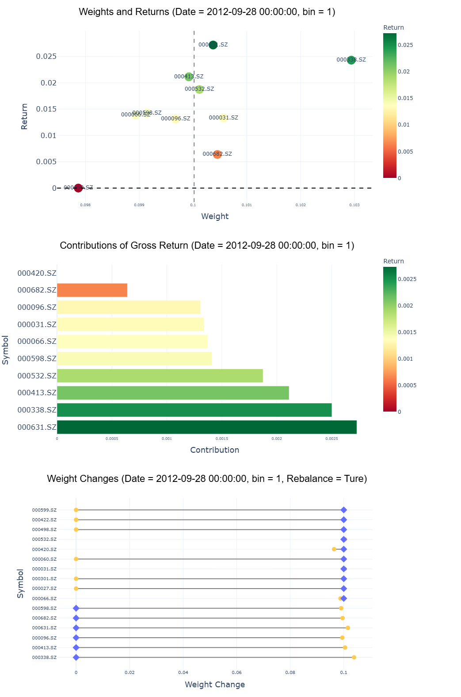
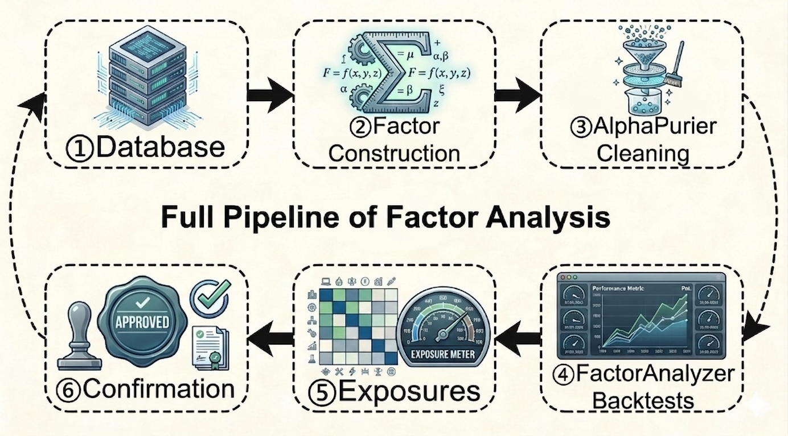
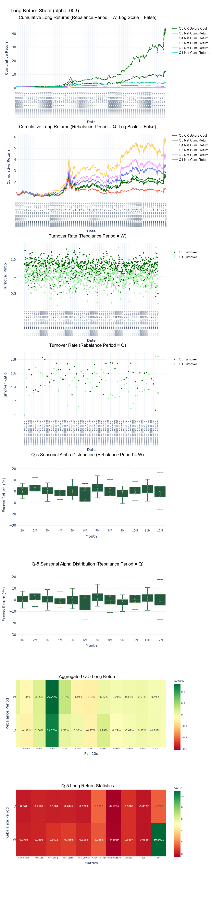

<p align="center">
  <a href="https://pypi.python.org/pypi/alphapurify">
    
  </a>
  <a href="https://pypi.python.org/pypi/alphapurify">
    
  </a>
  <a href="https://pypi.python.org/pypi/alphapurify">
    
  </a>
  <a href="LICENSE">
    
  </a>
  <a href="https://pypi.org/project/alphapurify/#files">
    
  </a>
</p>

<p align="center">
  <a href="README.md">English README</a> | <a href="README_CN.md">简体中文 README</a> | <a href="README_CN2.md">繁体中文 README</a>
</p>

# AlphaPurify: Factor research for quants

**AlphaPurify** Python library for factor construction, preprocessing, backtesting, and factor return attributions to help quants rapidly validate ideas.

---

## **What's NEW!** &nbsp;   :sparkling_heart:

### 1. 100% live-market-aligned factor backtesting:
### Vectorized modeled with comprehensive transaction fees, stamp duty and market slippage. It perfectly replicates real-world weight drift and periodic rebalancing logic, achieving a 1:1 restoration of actual trading behaviors.

### 2. Powerful ``FactorAnalyzer.trace()`` visualization module:
### Supports cross-sectional snapshot analysis at any designated time point. You can inspect stock weights, individual asset returns under different positions after backtests, and detailed rebalancing position adjustment records. All results are rendered into high-quality interactive Plotly charts directly for intuitive strategy diagnosis.


---

## ``AlphaPurify`` has 4 Main Modules:

  1.**`alphapurify.FactorAnalyzer`** — for IC/ Rank IC testing and Long/ Short/ Long-Short quantile backtests.

  2.**`alphapurify.AlphaPurifier`** — for factor preprocessing, including 40+ Winsorization, Neutralization, and Standardization methods (e.g., ridge regression, lasso regression, PCA decomposition, etc.).

  3.**`alphapurify.Database`** — for financial data aggregation, factor construction, and factor storage.

  4.**`alphapurify.Exposures`** — for factor correlation analysis and factor-based return attribution.

---

## Pipeline Overview

--- 

### Full Documents & Examples: **[English Docs](./examples)**

---

## Key Features:

### - Extremely Fast — Processes 4 Millions+ rows (15 years CSI 300) including long/short, long-short, IC backtests and creates 4 interactive reports in under 25 seconds (on a standard i7 CPU).

### - Stable at Scale — Reliably handles tens of millions of rows (minute-level data) with memory-optimized design to prevent overflow.

### - 40+ Preprocessing Methods — Built-in professional factor cleaning tools supporting workflows from ultra high-frequency to low-frequency data.

### - Flexible Horizons — Supports unlimited rebalance periods and IC lookback windows simultaneously for rich multi-dimensional factor analysis.

---

## AlphaPurify vs Other Quant Libraries

| Feature / Library | AlphaPurify | Qlib | Backtrader | Alphalens | QuantStats | Pyfolio |
|:------------------|:------------|:--------|:------------|:------------|:-------------|:-------------|
| Computation Speed | 🚀 Very Fast (Rust vectorized + multiprocessing) | ❌ Slow (heavy infrastructure) | ⚠️ Medium | ✅ Fast | no backtest | no backtest |
| Factor Preprocessing (40+) | ✅ Built-in | ⚠️ Limited | ❌ No | ❌ No | ❌ No | ❌ No |
| IC Analysis | ✅ Native | ✅ Yes | ❌ No | ✅Yes | ❌ No | ❌ No |
| Long / Short / Long-Short Rebalancing Quantile Backtest | ✅ Native | ✅ Yes | ⚠️ Indirect | ❌ No | ❌ No | ❌ No |
| Factor Return Attribution | ✅ Native | ⚠️ Indirect | ❌ No | ❌ No | ❌ No | ❌ No |
| Multi-Frequency Support | ✅ Any (microsecond → yearly) | ⚠️ Limited | ⚠️ Mostly daily | ⚠️ Mostly daily | ⚠️ Limited | ⚠️ Limited |
| Setup Complexity | 🟢 Low | 🔴 High | 🟡 Medium | 🟢 Low | 🟢 Low | 🟢 Low |
| Data Backend Support | ✅ Parquet + DuckDB | ⚠️ Custom infra | ❌ None | ❌ None | ❌ None | ❌ None |

While ``AlphaPurify`` may look similar to ``Alphalens``, it goes far beyond IC analysis and simple graphs.
It supports long, short, and long-short rebalancing backtests, factor cleaning, atributions and delivers a new generation of interactive visualizations by Plotly.

``AlphaPurify`` is different from libraries like ``QuantStats`` and ``Pyfolio``, which primarily focus on analyzing return curves and portfolio performance, not backtests. Compared to tools like ``Qlib`` and ``Backtrader``, ``AlphaPurify`` directly provides a lightweight, fast factor-driven rebalancing backtesting framework — eliminating the need for users to build custom pipelines or infrastructure in these libraries.

In short, ``AlphaPurify`` provide quants with a whole factor testing pipeline and beautiful interactive reports to rapidly validate ideas.

---

##  Quick Start

### 1.Install with pip
Users can easily install ``AlphaPurify`` by pip according to the following command.

```bash
pip install alphapurify
```
**Note**: pip will install the latest stable ``AlphaPurify``. However, the main branch of AlphaPurify is in active development. If you want to test the latest scripts or functions in the main branch. Please install ``AlphaPurify`` with clone.

---

### 2.Load your DataFrame
| datetime           | symbol | close | volume | alpha_003 | momentum_12_1 | vol_60 | beta_252 |
|:-------------------|:------|------:|------:|------:|--------------:|------:|--------:|
| 2024-01-01 09:30   | AAPL  | 189.9 | 120034 | 0.42 | 0.15 | 0.21 | 1.08 |
| 2024-01-01 09:31   | AAPL  | 190.0 | 98321  | 0.38 | 0.16 | 0.22 | 1.07 |
| 2024-01-01 09:32   | AAPL  | 190.4 | 101245 | 0.41 | 0.17 | 0.23 | 1.06 |
| 2024-01-01 09:30   | MSFT  | 378.5 | 84211  | -0.15 | -0.05 | 0.18 | 0.95 |
| 2024-01-01 09:31   | MSFT  | 378.9 | 90122  | -0.12 | -0.04 | 0.19 | 0.96 |
| 2024-01-01 09:32   | MSFT  | 379.1 | 95433  | -0.08 | -0.03 | 0.20 | 0.97 |

**P.S. Your DataFrame must include a time column, an asset identifier column, a price column, and your factor column to ensure proper usage.**

---

### 3.Creating backtesting reports
```bash
from alphapurify import AlphaPurifier, FactorAnalyzer

# preprocess
df = (
    AlphaPurifier(df, factor_col="alpha_003")
    .winsorize(method="mad")
    .standardize(method="zscore")
    .to_result()
)

#backtest
FA = FactorAnalyzer(base_df=df,
                    trade_date_col='datetime',
                    symbol_col='symbol',
                    price_col='close',
                    factor_name='alpha_003')
FA.run()
FA.create_long_return_sheet()
FA.create_long_short_return_sheet()
FA.create_short_return_sheet()
FA.create_single_fac_ic_sheet()

#contributions of other factors
Ex = PureExposures(
    base_df=df,
    trade_date_col='datetime',
    symbol_col='symbol',
    price_col='close',
    factor_name='alpha_003',
    exposure_cols=['momentum_12_1', 'vol_60', 'beta_252'],
)

Ex.run()
Ex.plot_pure_exposures()
Ex.plot_pure_returns()
Ex.plot_pure_exposures_and_returns()
Ex.plot_correlations()
```

---

## Examples of Backtesting Reports
### Portfolio for long positions only:

### Return attributions of other factors:


---

### If you like AlphaPurify, please star & fork this project to support the development!

---

**Elias Wu**


